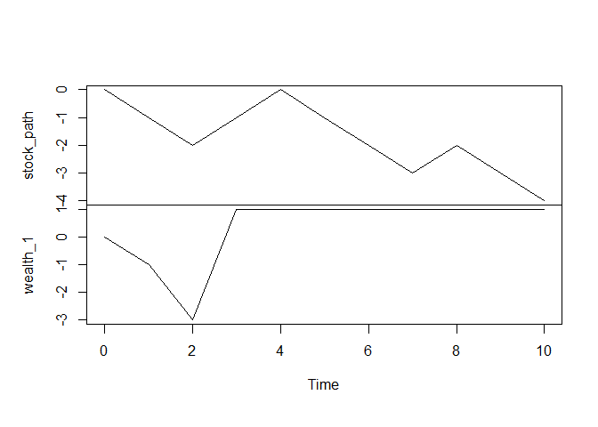

```r
rm(list = ls())
SimulateSRW <- function(time_terminal, initial_position = 0) {
  # Generate a simulated path of the simple random walk
  #
  # Args:
  #   time_terminal > 0: terminal time (so lenght of output is 1 + time_terminal)
  
  initial_position + c(0, cumsum(sample(c(1, -1), size = time_terminal, replace = TRUE)))
}
```

Stop betting one betting strategy wins

```r
StochasticIntegral <- function(strategy, stock_path) {
  # Compute a pathwise discrete stochastic integral
  #
  # Args:
  #   stock_path: a given path of the process S
  #   strategy(s, stock_path): a function depending on the current
  #                           time and the path (predictable)

  my_integral <- numeric(length(stock_path))
  my_integral[1] <- 0
  
  n_time_period <- length(stock_path) - 1
  
  for(s in 1:n_time_period) {  # s is regarded as time
    position <- strategy(s, stock_path)
    my_integral[1 + s] <- my_integral[s] + position*(stock_path[1 + s] - stock_path[s])
    stopping_time <- s+1
    if ((stock_path[1 + s] - stock_path[s]) == 1) { # if win break
        break
    }
  }
   if (stopping_time != n_time_period+1) {
   for (k in stopping_time:n_time_period) {
      my_integral[1+k] = my_integral[k]
   }
       }
  my_integral
  print(my_integral)
}
```

Martingale Strategy (keep doubling bet until you eventually win)

```r
MartingaleStrategy <- function(s, stock_path) {
    lamda <- 2
    if (s == 1) {
        position <- 1
    }
    else {# if you lose
        position <- lamda ** (s-1)
    }
    position
}
```


sample stock path

```r
# Illustration
time_T <- 10
stock_path <- c(0, -1, -2, -1, 0, -1, -2, -3, -2, -3, -4)
wealth_1 <- StochasticIntegral(MartingaleStrategy, stock_path)
```

```
##  [1]  0 -1 -3  1  1  1  1  1  1  1  1
```

```r
plot(ts(cbind(stock_path, wealth_1), frequency = 1, start = 0),
     main = "")
```

<!-- -->
